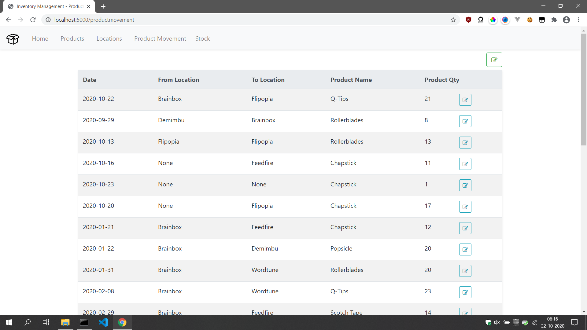
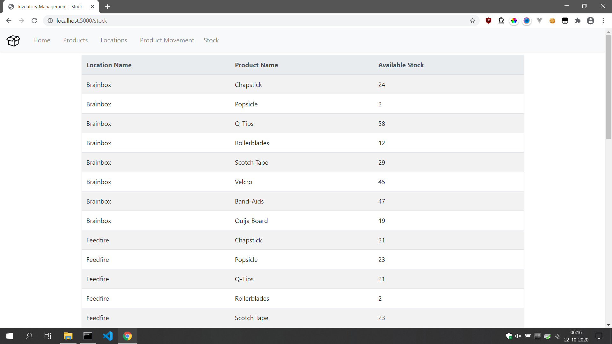

# Inventory Management System

## ⛏️ Built With 

-   [Python](https://www.python.org/)
-   [Flask](https://flask.palletsprojects.com/en/1.1.x/)
-   [SQLAlchemy](https://www.sqlalchemy.org/)
-   [BootStrap 4.5](https://getbootstrap.com/)
-   [Jinja2](https://jinja.palletsprojects.com/en/2.11.x/)
-   [WTForms](https://wtforms.readthedocs.io/en/2.3.x/)

### Get started:

-   Clone this repo: `git clone https://github.com/ankit2818/inventory-management.git`
-   Change directory: `cd inventory-management`
-   Install required modules: `pip install -r requirements.txt`
-   To run server: `python app.py`\
    Server should be started on `Localhost:5000`

# Commit history:

-   [See Commit History](https://github.com/ankit2818/inventory-management/commits/master/)

# Screenshots 

</img>
</img>
</img>
</img>
</img>
</img>
</img>
</img>
</img>
</img>
</img>

# Functionality

    ❖ Add/View/Edit Products
    ❖ Add/View/Edit Locations
    ❖ Add/View/Edit Product Movements
    ❖ View Stock

## ✍️ Author 

-   [@Ankit Vishwakarma](https://github.com/ankit2818) - Inventory-Management
